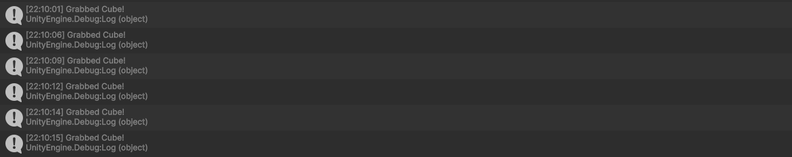

# XR Interaction Toolkit

- **Alumno:** Adrián García Rodríguez
- **Correo:** alu0101557977@ull.edu.es

## Escena

Para la realización de esta escena, ha sido necesario seguir los pasos de la configuración del `Sistema de Interacción para Aplicaciones XR - AR`, y posteriormente añadir el GameObject `XR Origin (XR Rig)`, un prefab que sirve como controlador.

### Cubo lejano

Primeramente, se ha creado un primer cubo colocado relativamente lejos del jugador. A fin de que este objeto no pueda ser levantado y arrastrado por el jugador, se le ha añadido el componente `XR Simple Interactable`. Este cubo contendrá un script con una clase que define el método `OnSelectEnter`, que luego estará suscrito a `SelectEntered` del componente `XR Simple Interactable`. De esta forma, el jugador podrá cambiar el color del cubo al seleccionarlo, pero no podrá agarrarlo.

```c#
using UnityEngine;
using UnityEngine.XR.Interaction.Toolkit;

public class ChangeColorOnSelection : MonoBehaviour
{
  private Renderer rend;

  public void OnSelectEnter(SelectEnterEventArgs informationSelect)
  {
    Color randomColor = new Color(Random.value, Random.value, Random.value);
    rend.material.color = randomColor;
  }

  void Start()
  {
    rend = GetComponent<Renderer>();
  }
}
```

### Cubo cercano

Posteriormente, se ha creado un segundo cubo, esta vez más cercano al jugador. En esta ocasión, para que el jugador pueda levantarlo y arrastrarlo, se le ha añadido el componente `XR Grab Interactable`. El script creado para este objeto, contiene una clase que define el método `PrintMessage`, que luego estará suscrito a `SelectEntered` del component `XR Grab Interactable`. Así pues, cuando el jugador agarre el cubo, se imprimirá un mensaje por la consola.

```c#
using UnityEngine;
using UnityEngine.XR.Interaction.Toolkit;

public class MessageOnGrab : MonoBehaviour
{
  public void PrintMessage(SelectEnterEventArgs informationSelect)
  {
    Debug.Log("Grabbed Cube!");
  }
}
```

### Configuración de los controles

Por último, ha sido necesario acceder al sistema de movimiento del prefab `XR Origin (XR Rig)` y seguir la siguiente ruta:

`Action Maps` -> `XRI Right Interaction` -> `Select` -> `Add Binding` -> `TriggerButton [RightHand XR Controller]`

Enlazando así la función `select` con el trigger del mando derecho, para así poder interactuar con los elementos de la escena que se configuraron previamente.

## Ejemplo de visualización

[](https://youtu.be/T1NunNY9KkA)

▶️ [Ver en YouTube](https://youtu.be/T1NunNY9KkA)


